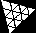

# 3D Maze Solving


Practice calculating 3-dimensional geometric space and algorithms for creating and solving mazes in 3D.

[](https://www.typescriptlang.org/) **&** [](https://github.com/mrdoob/three.js) **&** [](https://github.com/dataarts/dat.gui) dat.GUI

### Compile & Debug

- Use `npm` command:

```bash
npm install
npm run dev
```

### Deploy project to Github Pages

- Use `npm run` to build and test folder `dist/`:

```bash
npm run build
npm run preview
```

- Deploy to Github Pages:

```bash
npm run deploy
```
